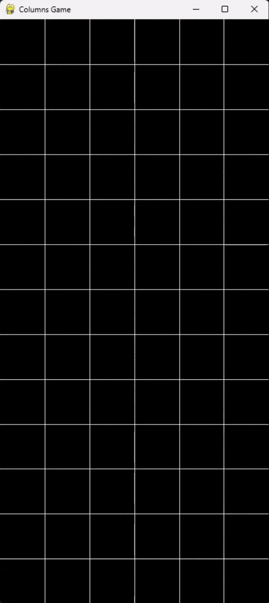

## About

This is a recreation of the match-three video game Columns, released by Sega in 1990. 

  
    

## How to Run

1. Setup
    - Create virtual environment
        - `python -m venv venv`
    - Activate vitural environment
        - Windows: `.\venv\Scripts\activate.bat`
        - Mac/Linux: `./venv/Scripts/activate.bat`
    - Install dependencies
        - `pip install -r requirements.txt`

2. Run
    - `python columns_gui.py`

3. Deactivate virtual environment
    - Windows: `.\venv\Scripts\deactivate.bat`
    - Mac/Linux: `./venv/Scripts/deactivate.bat`

## Controls

- Space Bar : Rotate faller
- $\leftarrow$ : Move faller left
- $\rightarrow$ : Move faller right
- $\downarrow$ : Move faller down
